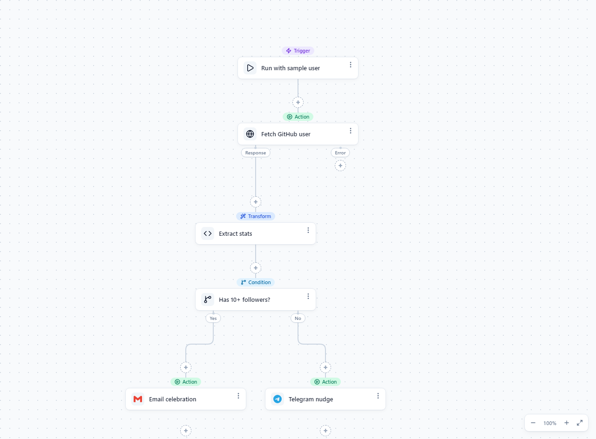
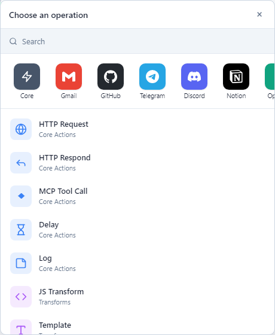
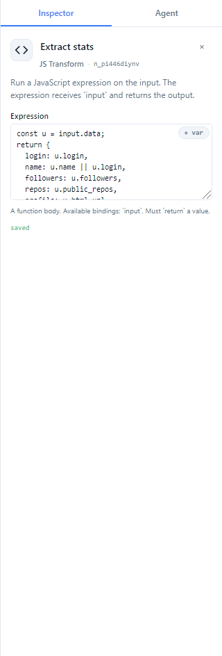
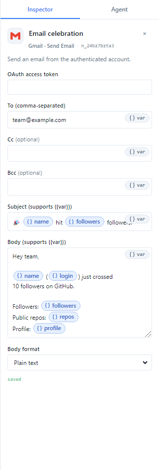
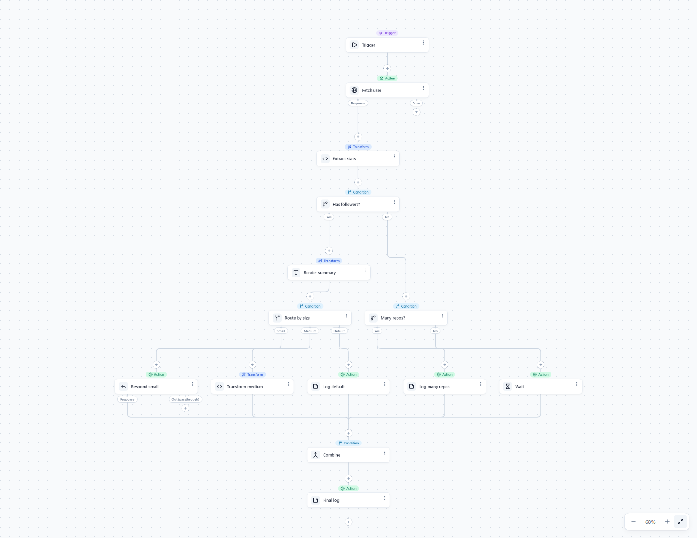
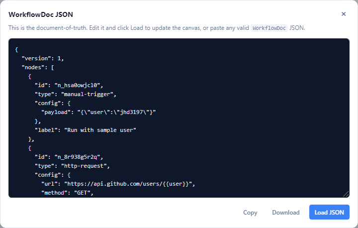

<div align="center">

# tramo

**Embed a workflow editor in your app.**

A visual, node-based automation builder that outputs plain JSON and runs anywhere —
in the browser, on a Node server, in a CLI job, or in Python.

<br>

[](LICENSE)
[](https://www.typescriptlang.org)
[](https://reactjs.org)
[](https://nodejs.org)

<br>

[Features](#-features) · [Quick Start](#-quick-start) · [Screenshots](#-screenshots) · [Architecture](#-architecture) · [Roadmap](#-roadmap) · [Docs](#-documentation)

</div>

---

<p align="center">
  
</p>

---

<!-- TRAMO:SHOTS:START -->
## 📸 Screenshots

> Captured from the live demo build.

<details open>
<summary><strong>Visual Canvas</strong> — Drag-and-drop node editor with auto-layout, branching, and a dotted workflow grid</summary>


</details>

<details>
<summary><strong>Step Picker</strong> — Browse built-ins, logic, transforms, AI nodes, and 21 brand integrations</summary>



</details>

<details>
<summary><strong>Node Inspector</strong> — Configure every node in the right-hand rail with typed fields and live validation</summary>



</details>

<details>
<summary><strong>Variable Picker</strong> — Reference upstream step outputs with clickable chips and autocomplete</summary>



</details>

<details>
<summary><strong>Branching</strong> — Route execution through Yes/No, switch cases, and merge nodes</summary>


</details>

<details>
<summary><strong>Complex flows</strong> — Nested Ifs, Switch cases, and Merge nodes all fan out and converge cleanly</summary>



</details>

<details>
<summary><strong>Open JSON</strong> — View, copy, download, or paste the WorkflowDoc JSON at any time</summary>



</details>
<!-- TRAMO:SHOTS:END -->

## 🎯 Features

### 🎨 Visual Editor

**Custom Canvas Engine** — No XYFlow dependency; pan, zoom, and auto-layout derived directly from the DAG.

**Node Inspector** — Right-rail configuration for every built-in and integration node.

**Step Picker** — Searchable catalog of triggers, actions, transforms, logic, loops, state, sub-flows, AI, and brand integrations.

**Variable Chips** — Reference upstream outputs with `{{steps.<slug>.<path>}}` chips; rename a step and downstream refs rewrite automatically.

**Undo / Redo** — 100-step history built into `useWorkflow`.

**Agent Chat** — Built-in Anthropic-powered assistant that edits the doc through the same `apply_patch` surface as the UI.

### ⚡ Runtime

**Same JSON, Everywhere** — A `WorkflowDoc` runs in the browser, Node CLI (`@tramo/cli`), or a future Python runtime with identical semantics.

**Topological Execution** — Runner schedules nodes by dependency order with support for branching, loops, sub-flows, and per-node `runAfter` policies.

**Triggers** — `manual-trigger`, `webhook-trigger`, and `cron-trigger` drivers included.

**Cross-Node References** — Any completed upstream step is reachable via `steps.<id-or-slug>.<path>` in templates and JS expressions.

**Sub-Flows** — Compose workflows with `flow-input` / `flow-output` / `call-flow`.

### 🔌 Integrations

**Brand Packs** — 21 first-party packs: Gmail, GitHub, Telegram, Discord, Notion, OpenAI, Anthropic, Linear, Airtable, Stripe, Cloudflare, Google Drive, Google Sheets, Google Tasks, Outlook, Postgres, Twilio, YouTube, X, Trello, Box.

**Opt-In Bundles** — Install only the packs you need; tree-shaking drops the rest.

**MCP Import** — Import any MCP server as a tile; tools become first-class nodes.

> ⚠️ **Note:** Integration packs currently ship stub executors that return a deterministic envelope. Real API calls are being wired up — the editor surface and node definitions are ready today.

### 🤖 Agent-Native

**Patch-Based Editing** — Every UI action maps to a typed `Patch`; LLMs emit the same patches through `buildPatchToolSpec`.

**Schema-Constrained Tools** — The generated tool spec restricts node types and validates configs against each definition's fields.

---

## 🚀 Quick Start

> ⏱️ Up and running in under 2 minutes

### Option 1: Install from npm

```bash
npm install tramo react react-dom
```

```tsx
import { Canvas, RightRail, useWorkflow } from 'tramo';
import { emptyDoc, BUILTIN_REGISTRY, type WorkflowDoc } from 'tramo/spec';
import { combinePacks, BUILTIN_PACK } from 'tramo/runtime';
import GMAIL from 'tramo/integrations/gmail';
import 'tramo/styles.css';

const { nodes: registry } = combinePacks([BUILTIN_PACK, GMAIL]);

export function MyEditor({ initial, onSave }: {
  initial: WorkflowDoc;
  onSave: (doc: WorkflowDoc) => void;
}) {
  const workflow = useWorkflow({ registry, loadDoc: () => initial, saveDoc: onSave });

  return (
    <div style={{ display: 'grid', gridTemplateColumns: '1fr 360px', height: '100vh' }}>
      <Canvas workflow={workflow} registry={registry} />
      <RightRail
        selection={workflow.selection}
        registry={registry}
        onApply={workflow.applyPatch}
        onClose={workflow.clearSelection}
        saveState={workflow.saveState}
      />
    </div>
  );
}
```

### Option 2: Run the demo locally

```bash
git clone https://github.com/jhd3197/tramo.git
cd tramo
npm install
npm run demo   # → http://localhost:5181
```

### Option 3: CLI only

```bash
npm install -g @tramo/cli
tramo run workflow.json --trigger '{"user":"juan"}'
tramo validate workflow.json
```

---

## 🏗️ Architecture

```
 user clicks / drags        LLM tool-call emits
       │                            │
       ▼                            ▼
   ┌─────────────── apply_patch ───────────────┐
   │                                            │
   ▼                                            ▼
 WorkflowDoc (JSON)  ◄── one source of truth ──►  same doc
   │
   ▼
 @tramo/runtime  (JS) — topo-sort + execute the graph
   │
   ▼
 nodeResults + per-node events
```

**Spec / Editor / Runtime split**

| Package | Role |
|---|---|
| `@tramo/spec` | The wire contract — doc model, patches, registry, pure utilities. |
| `@tramo/editor` | React editor components + LLM agent glue. |
| `@tramo/runtime` | Reference TypeScript executor and scheduler. |
| `@tramo/cli` | `tramo run` / `tramo validate` binaries. |
| `tramo` | Umbrella meta-package with subpath exports (`tramo/react`, `tramo/spec`, `tramo/runtime`, `tramo/integrations/<brand>`). |

---

## 🧱 Built-In Nodes

| Category | Nodes |
|---|---|
| **Triggers** | `manual-trigger`, `webhook-trigger`, `cron-trigger` |
| **Actions** | `http-request`, `http-respond`, `mcp-tool-call`, `delay`, `log` |
| **Transforms** | `js-transform`, `template`, `json-parse`, `json-stringify` |
| **Logic** | `if`, `switch`, `merge` |
| **Loops** | `for-each`, `loop-start` / `loop-end` |
| **State** | `set-var`, `increment-var`, `append-var` |
| **Sub-Flows** | `flow-input`, `flow-output`, `call-flow` |
| **AI** | `ai-prompt` |

---

## 🗺️ Roadmap

- [x] Custom canvas engine with auto-layout
- [x] Versioned JSON doc model
- [x] Topological runner with branching and loops
- [x] Cross-node references with slug rewriting
- [x] Sub-flow trio (`flow-input` / `flow-output` / `call-flow`)
- [x] Manual, webhook, and cron triggers
- [x] MCP server import
- [x] 21 first-party integration packs (editor surface + stubs)
- [x] `@tramo/cli` binaries
- [ ] Real API executors for integration packs
- [ ] Parallel execution within topological layers
- [ ] Per-node retry / backoff
- [ ] Streaming `run()` variant
- [ ] Persistent workflow state / resume after crash
- [ ] `@tramo/server` long-running host

---

## 📖 Documentation

| Document | Description |
|---|---|
| [packages/spec/README.md](packages/spec/README.md) | The wire format and document model |
| [packages/runtime/README.md](packages/runtime/README.md) | Executor, scheduling, and node packs |
| [packages/tramo-editor/README.md](packages/tramo-editor/README.md) | React editor components |
| [packages/cli/README.md](packages/cli/README.md) | CLI usage |

---

## 💻 Tech Stack

| Layer | Technology |
|---|---|
| Language | TypeScript 5.4+ |
| Editor | React 18/19, SCSS, custom canvas |
| Runtime | Node 18+, native `fetch` |
| Spec | Zero runtime deps (only `nanoid`) |
| Testing | Vitest |
| Build | TypeScript + Vite (demo) |

---

## 🤝 Contributing

Contributions are welcome! Fork → feature branch → commit → push → pull request.

**Priority areas:** Real integration executors, UI component tests, documentation, and example workflows.

---

<div align="center">

**tramo** — Workflows as JSON.

[Report Bug](https://github.com/jhd3197/tramo/issues) · [Request Feature](https://github.com/jhd3197/tramo/issues)

Made with ❤️ by [Juan Denis](https://juandenis.com)

</div>
